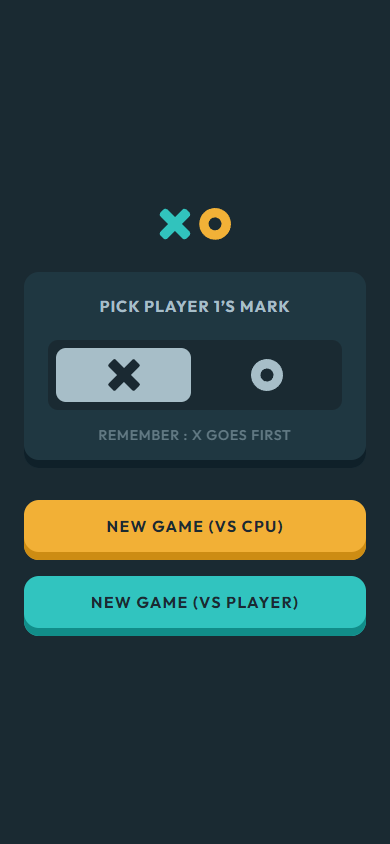
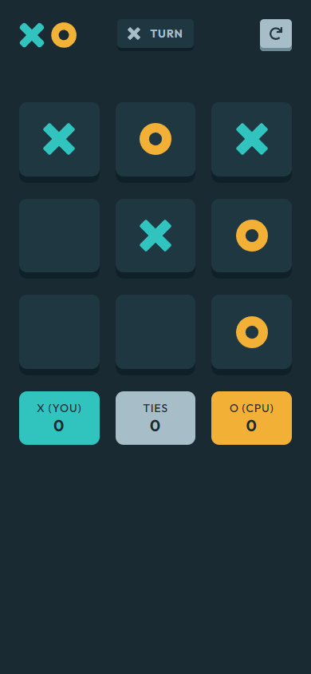
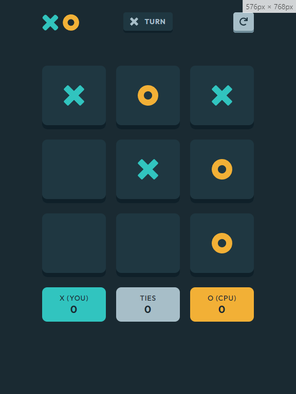
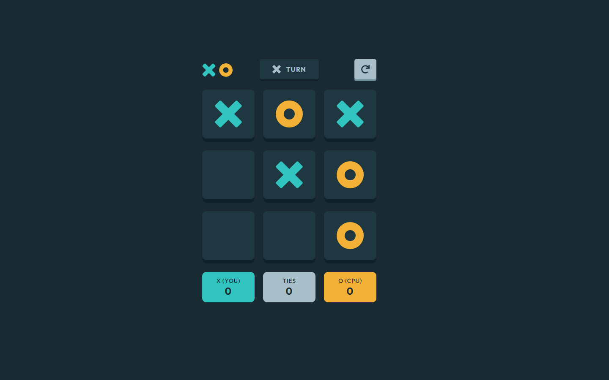

# Frontend Mentor - Tic Tac Toe solution

This is a solution to the [Tic Tac Toe challenge on Frontend Mentor](https://www.frontendmentor.io/challenges/tic-tac-toe-game-Re7ZF_E2v). Frontend Mentor challenges help you improve your coding skills by building realistic projects.

## Table of contents

- [Overview](#overview)
  - [The challenge](#the-challenge)
  - [Screenshot](#screenshot)
  - [Links](#links)
- [My process](#my-process)
  - [Built with](#built-with)
  - [What I learned](#what-i-learned)
- [Author](#author)
- [Contribution](#contribution)

## Overview

### The challenge

Users should be able to:

- View the optimal layout for the game depending on their device's screen size
- See hover states for all interactive elements on the page
- Play the game either solo vs the computer or multiplayer against another person

Bonus:

- Save the game state in the browser so that it’s preserved if the player refreshes their browser
- Instead of having the computer randomly make their moves, try making it clever so it’s proactive in blocking your moves and trying to win

### Screenshot

- Mobile (newgame) (390px)



- Mobile (board) (390px)



- Tablet (768px)



- Desktop (1440px)



### Links

- [Solution URL](https://www.frontendmentor.io/solutions/planets-fact-site-react-typescript-postcss-animejs-AqhbRhDKf_)
- [Live Site URL](https://planets-fact-site-acdev.vercel.app/)

## My process

### Built with

- Semantic HTML5 markup
- CSS custom properties
- Flexbox / Grid
- Mobile-first workflow
- [Typescript](https://www.typescriptlang.org/)
- [React](https://react.dev/)
- [PostCSS](https://postcss.org/)

### What I learned

#### Tic-Tac-Toe BOT

I made my first ever bot for a game for this project. A rather simple bot, but it was a lot of fun. I chose not to "hardcode" the best moves at the start so that the game does not always end on a draw.

```ts
export const getCpuNextMove = (currentBoard: Store['currentBoard'], currentMark: Mark) => {
  const clone = [...currentBoard];
  const legalMoves: number[] = [];
  for (let i = 0; i < clone.length; i++) {
    const curr = clone[i];
    if (curr !== '') continue;
    legalMoves.push(i);
  }

  /* play 1st winning move */
  for (let i = 0; i < legalMoves.length; i++) {
    const curr = legalMoves[i];
    const offenseArr = [...currentBoard];
    offenseArr[curr] = currentMark;
    if (checkWinner(offenseArr, currentMark, 5)) return curr;
  }

  /* Play 1st defense move */
  const oppositeMark = currentMark === 'x' ? 'o' : 'x';
  for (let i = 0; i < legalMoves.length; i++) {
    const curr = legalMoves[i];
    const offenseArr = [...currentBoard];
    offenseArr[curr] = oppositeMark;
    if (checkWinner(offenseArr, oppositeMark, 5)) return curr;
  }

  /* Play random legal move */
  const randomIndex = legalMoves[Math.floor(Math.random() * legalMoves.length)];
  return randomIndex;
};
```

#### React StrictMode

I had a really annoying "bug" with the behavior of React StrictMode component. Since React 18 it will mount each component twice wich led to my bot playing two time in some instances. It took me some time to realise why and correct this behavior.

## Author

- Frontend Mentor - [@AntoineC-dev](https://www.frontendmentor.io/profile/AntoineC-dev)

## Contribution

You can use this project for whatever you want. Don't forget to leave a ⭐.

- Fork the project to add it to your githug repositories.
- Clone it on your local machine from you repositories.
- Install all the dependencies by running `npm install` or `yarn` or `pnpm` from a terminal located in the project.
- Open the project in your editor and start coding.
